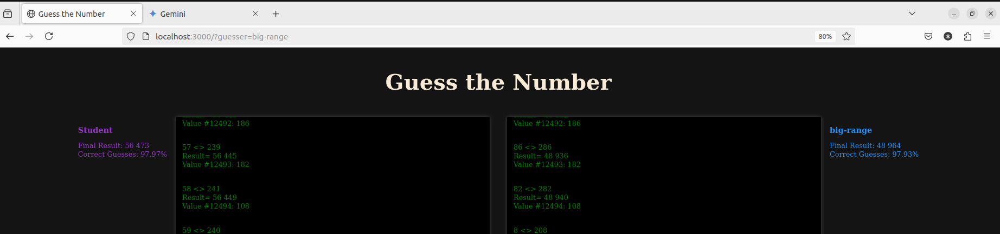
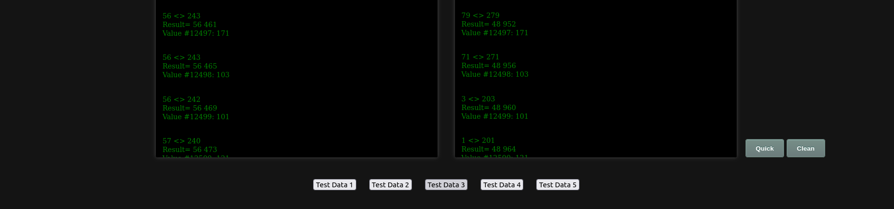

# Number Guessing Program
## Description

This project is a number guessing program designed to predict the range in which the next number in a sequence will fall. By leveraging mathematical concepts of linear regression, the program aims to provide an optimal range for the next input number. The goal is to find a balance between the range size and prediction accuracy.

## How to Run

1. Ensure you have Python installed on your system.
2. Clone or download this repository.

```bash
    git clone https://github.com/stkisengese/guess-it-2.git
    cd guess-it-2
```
3. Make the script.sh file inside student folder executable.

```bash
    chmod +x script.sh
```
4. Run the program.

```bash
    $ python3 guess-it-2.py
```
**Usage**

    The program will read a sequence of numbers from standard input.
    For each number, it will print the predicted range for the next number in the sequence.

*Example*

```bash
$ python3 guess-it.py
123 --> the standard input(skips the first entry)
189 --> the standard input
120 200    --> the range for the next input, in this case for the number 113
113 --> the standard input
160 230    --> the range for the next input, in this case for the number 121
...
```
## Unittests
The test files are available inside the students directory. Run the testfile as shown:-
```bash
    $ python3 test_guess-it-2.py
```

## Testing

Download the provided tester [zip file](https://assets.01-edu.org/guess-it/guess-it-dockerized.zip).
Place the student/ folder in the root directory of the items provided in the tester.

1. Ensure `docker` is installed in your system.
2. Run the Docker setup to start the webpage on port 3000:

```bash
    docker-compose up --build
```
3. Open your browser and navigate to `http://localhost:3000/`.
4. Click on any Test Data buttons to test the program.
5. If prompted, add a guesser by appending `?guesser=<name_of_guesser>` to the URL, e.g., ?guesser=big-range.   

6. Click on the button `Test Data 4` or `Test Data 5` to select the data and click to run the guesser and click `clear` to   set up new data set.


## Implementation Details

The program calculates the optimal range using the average and standard deviation of the previously inputted numbers. This statistical approach ensures that the predicted range is both accurate and concise.

## License
[MIT License](LICENSE)

## Author

[Stephen Kisengese](https://github.com/stkisengese)